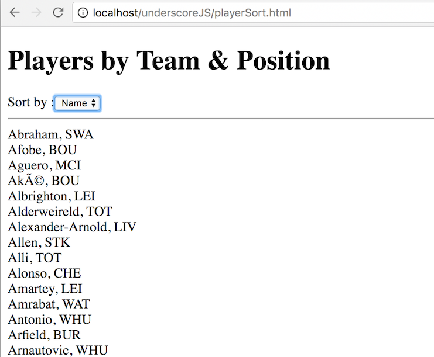

# Underscore Exercise 5 - Collection Functions Sorting
		
> Complete ALL the exercises in this section. If you need a solution just ask.


## Fetch latest Repository Branch

```
$ cd /DRIVE/xampp/htdocs/UnderScore
$ git pull --no-edit https://github.com/noucampdotorgSSAD/UnderScore.git latest
$ ls
$ git status

```

## Part 1 - ``sortBy()``

1.	Examine and open the file [http://localhost/UnderScore/playerSort.html](http://localhost/UnderScore/playerSort.html) from the ``underscore`` folder:

1.	When the dropdown box value is selected sort by name or team and display all the player names and team on separate lines.  Add your code solution to ``playerSort.js``.

	

1.	When you choose sort by team, attempt to sort the players name for that team too.

1.	Push your code to **your private** repository on GitHub.  Type these commands into your *Git Bash* client:

	```
	$ git status
	$ git add .
	$ git commit -m "Exercise 5 - DONE|PARTIAL|HELP"
	$ git push origin master
	$ git status

	```